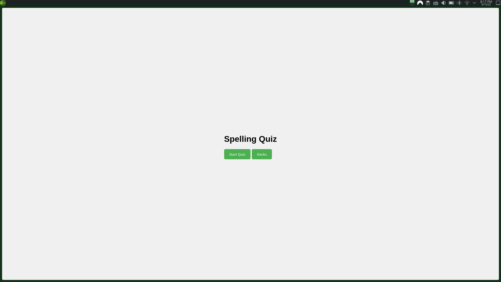
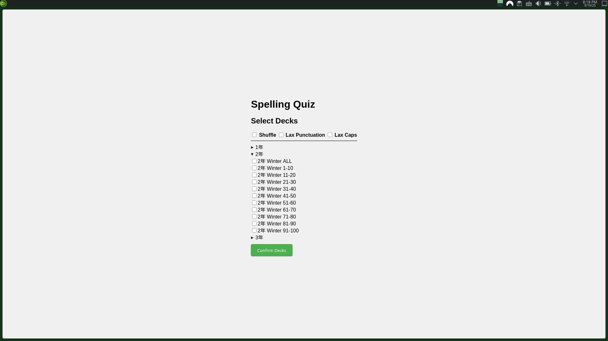
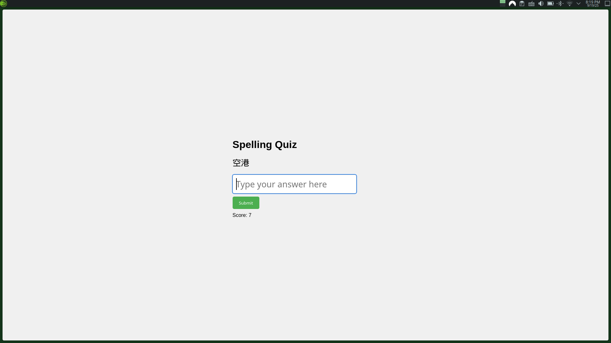
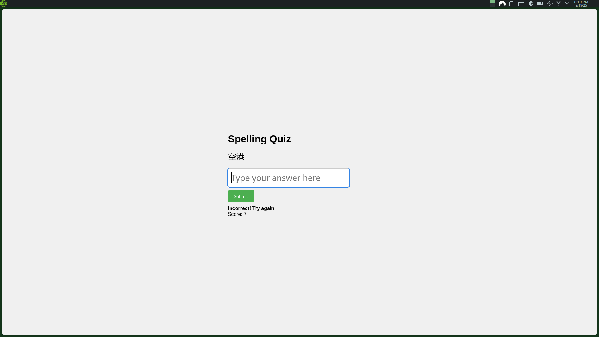
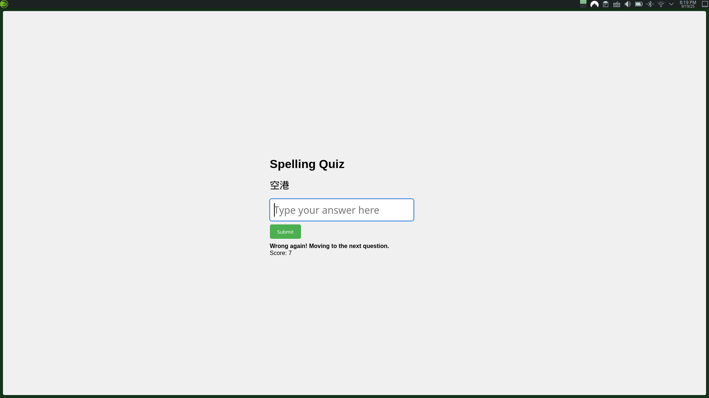
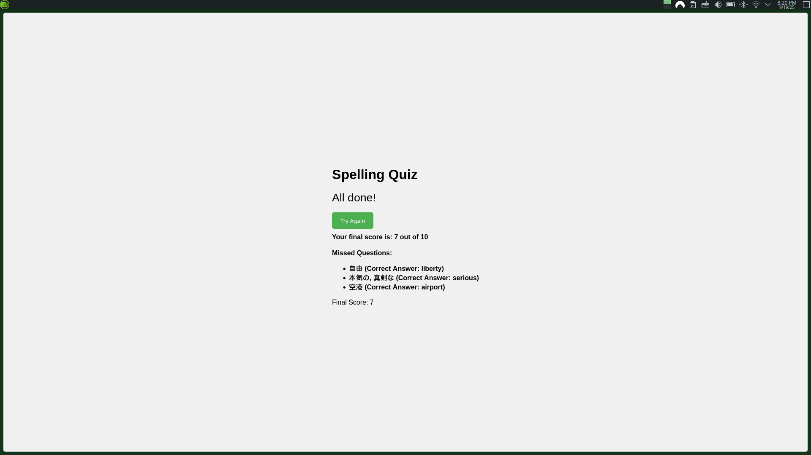

# Hosted on Github Pages - [Here](https://kentuckyfriedrice.github.io/vocabQuiz/)

### Intro and Setup
This is a web app as a basic flashcard web app where you must type the answer ***exactly***. It uses JSON files as decks with *Question* and *Answer* parameters. Unfortunately a limitation of this is that there is only one answer per question in the current layout.

Decks are stored in the *decks* directory at the root of this project directory. From then, decks must be manually added to the *decks menu* from the *includes/app.js* file. Near the top, there is an *availableDecks* variable created there. It lists the *grade* - basically drop down menus for added organization, *name* - The name of the deck which will be displayed, and the *file* - where the deck is stored.

After this is properly configured, these will then appear in the *deck menu* on the main page of the app. From here, the app will not continue unless a deck is selected and an error notification will appear if you try.

I also have made it so that a cookie is stored locally to save which decks and options you were using on the last visit. This way you don't have to set them every time. I wanted to use this functionality to save missed questions as a new deck when you refresh but in the end I didn't have time or the reason to continue on that path.

### In The Deck Menu

The deck menu will list the *grades* as drop down menus. Within each grade will be the *name* of each deck with a checkbox to use that deck. If your deck is not showing, please go back and make sure it is properly configured in the *includes/app.js* file.

At the top there are three checkboxes to customize the experience.
|Option|Result|
-----|-----
| Shuffle | Randomizes the deck |
| Lax Punctuation | Doesn't check for correct punctuation |
| Lax Capitalization | Doesn't check for capitalization |

From here, click the confirm button to load the decks and make the adjustments for the quiz. I added the *deck menu* so that it would give the app a few seconds to load in the vocabulary so that it seems seamless for the user.

### In The Quiz

After starting the quiz you will be shown a prompt, the *question*, a textbox to answer with, a submit button, and a score. The score goes up if you get the answer correct. You only get two tries. After the first miss, it will tell you to try again and automatically move on if you're wrong. The score goes up by 1 point if you get it correct.

### The Review Screen

After all questions have been shown, all missed questions, even those missed the first time, will show at the end as a list. It will display *Question*:*Answer*. This give students a chance to see all they missed and make a note of it.

Also on this page is the try again button which will bring you back to the home screen.

Unfortunately, there isn't a way to only focus on those words. If I were to work on this more I would likely include that or a login system of some sort. Both of which were too much for this test case. 

### Background
This is a small web app I made for my class to study vocab using typing instead of writing. It was difficult to find a site that was free and met my requirements.

Originally the idea was to allow students to type their vocabulary words to study rather than writing them over and over. Many students had been failing their vocabulary tests, but were interested in trying studying by typing. This was for the summer homework assignment; the goal was to study and memorize 100 vocabulary words. 

At first, I struggled to get the school I work for to whitelist a personal domain of mine and costs were adding up on my Amazon Web Services (AWS) server. I decided the simplest way to solve this issue was to host it on github pages since the userbase was so small and infrequent and github was already a trusted domain. This hindered my previous plans of allowing teachers to login and upload their own sets made by my *flashcardDeckManager* project (*link below*). Another problem was the students and teachers struggled to memorize the URL for any of my hosted pages for this project. My solution was to make a shortcut on the teachers' desktop and post the link directly to the students' class Microsoft Teams feed.

This was enough to test the idea. I worked with English teachers at multiple schools I work for to administer the test run. They would make the sets for the vocabulary which students would be tested on and I would upload them directly into the github project and change the titles manually within the *includes/app.js* file. I had hoped to change this to be all automated but it was much too early without properly testing that it would even be a viable solution to the students' poor performance on vocabulary tests. 

On the teachers' end, it went totally fine. The *flashcardDeckManager* webpage, while not elegant, completed the job it was made to do without any problems. Then on the students' side, The app was usable, but they found that the strict captialization of letters and punctuation made the quiz much more difficult than it needed to be. I did fix this issue by adding "Lax" punctuation and capitalization options in the decks menu. 

However, in the end while a few students did use the app to study at home for their vocabulary test, we came to the conclusion they really just didn't want to study no matter the format, making this project not viable. Another problem might have been the sheer number of vocabulary words to memorize and students notoriously waiting until the last second to do their summer homework. No matter the reason, the teachers didn't seem to be interested in continuing with this project so I put it on hold for now. 

At the beginning of this school year, I repurposed this project to get special needs students to practice focusing on capitalization and punctuation. For this attempt, we tried having the question and answer sections as the same so the students could copy it directly. It worked for this purpose but the feedback from the students was it was just too boring. I cannot blame them for this conclusion. I think if I were to make changes to this to make it more engaging, I would have feedback on the first try that showed what letters were correct and what letters were wrong so they could try again. Also I would take away the two attempt limit and add a skip button. After talking with the teacher about the outcome, we decided it would be best to try something more engaging and familiar.

### ***Links to associated or related projects***
#### ***Webpage to Make Vocabulary Sets For This App*** - [Here](https://kentuckyfriedrice.github.io/flashcardDeckManager/) - [github](https://github.com/KentuckyFriedRice/flashcardDeckManager)
#### ***Random Number Selector For Class*** - [Here](https://kentuckyfriedrice.github.io/StudentRoulette/) - [github](https://github.com/KentuckyFriedRice/StudentRoulette)
